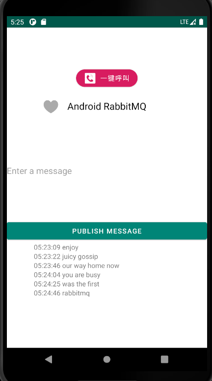

# Android端RabbitMQ的发布与订阅



- 使用IntentService异步执行发布或订阅

``` java
@Override
protected void onHandleIntent(Intent intent) {
  if (intent != null) {
    switch (Objects.requireNonNull(intent.getAction())){
      case ACTION_LISTEN: basicConsume(); break;
      case ACTION_PUBLIC:
        String message = intent.getStringExtra(EXTRA_MESSAGE);
        assert message != null;
        basicPublish(message); break;
      default: Log.e("AmqpService","ACTION NOT FOUND");
    }
   }
}
```

- 通过IntentService发布消息

``` java
@OnClick(R.id.publish_btn)
public void getPublish(){
  String msg = msg_text.getText().toString();
  AmqpService.startPublish(this,msg);
}
```

- EventBus接收消息内容并动态修改布局

``` java
@SuppressLint({"SimpleDateFormat", "SetTextI18n"})
@Subscribe(threadMode = ThreadMode.ASYNC)
public void OnEventProgress(String msg){
    Date now = new Date();
    SimpleDateFormat ft = new SimpleDateFormat ("hh:mm:ss");
    msg_list.setText(ft.format(now) + ' ' + msg );
}
```
